# Decision Intelligence App 🚀

تطبيق ذكاء الأعمال وصنع القرار (Decision Intelligence)، وهو تطبيق متطور مبني باستخدام إطار عمل Flutter. يهدف التطبيق إلى مساعدة المستخدمين والشركات على اتخاذ قرارات استراتيجية مبنية على البيانات (Data-driven Decisions) من خلال عرض تحليلات دقيقة ورسوم بيانية تفاعلية.

## ✨ المميزات (Features)
* **رسوم بيانية تفاعلية:** عرض البيانات والتحليلات بشكل مرئي باستخدام `fl_chart`.
* **تحديثات فورية (Real-time):** مزامنة البيانات بشكل لحظي باستخدام `SignalR`.
* **أداء عالي وسلس:** إدارة حالة التطبيق بكفاءة باستخدام نمط `BLoC`.
* **دعم التخزين المحلي:** حفظ بيانات المستخدم محلياً لسرعة الوصول باستخدام `Hive`.
* **تصميم عصري:** واجهة مستخدم (UI) جذابة وسهلة الاستخدام.

## 📸 لقطات من التطبيق (Screenshots)

  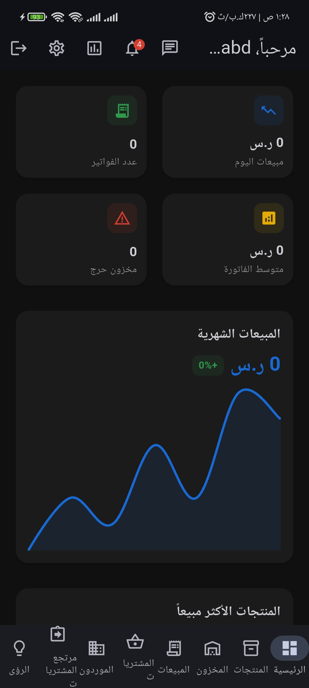
  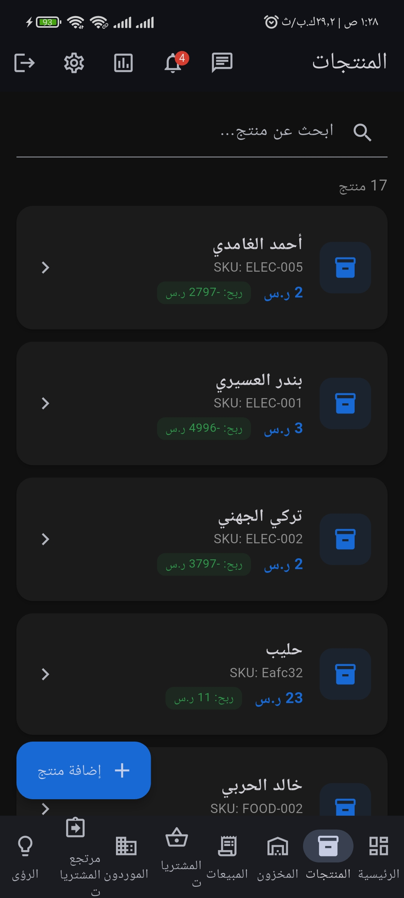
  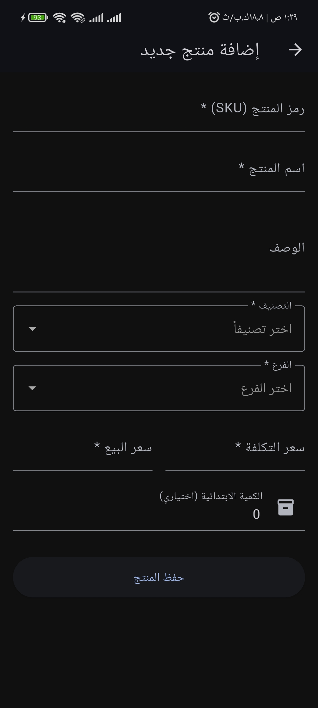
  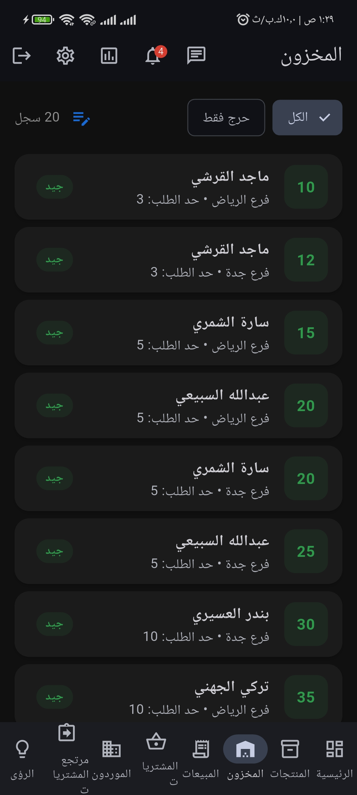
  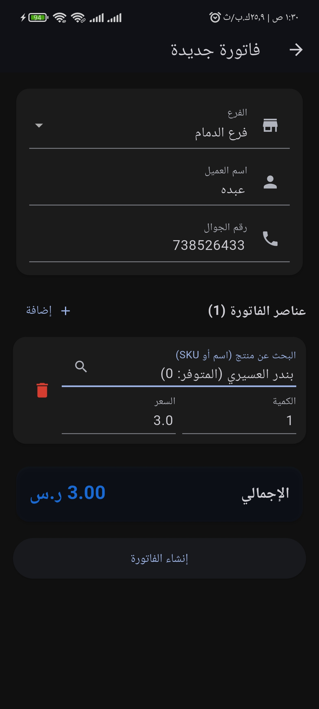
  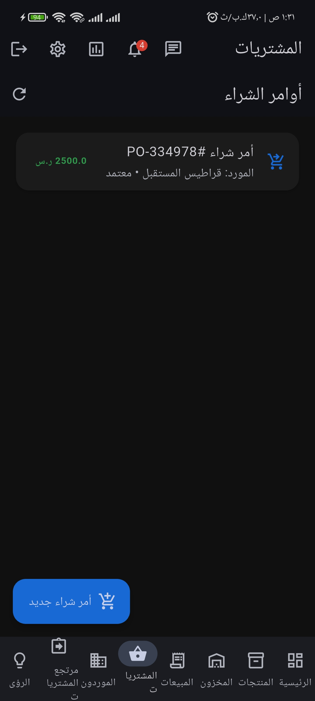
  
  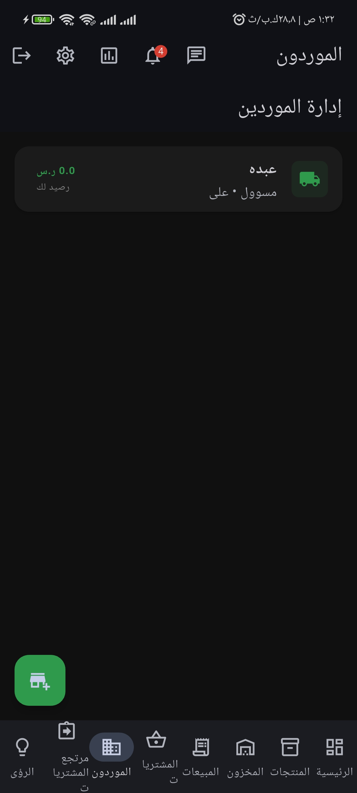
  
  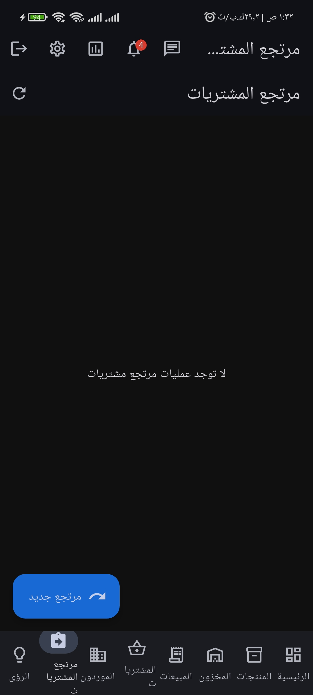
  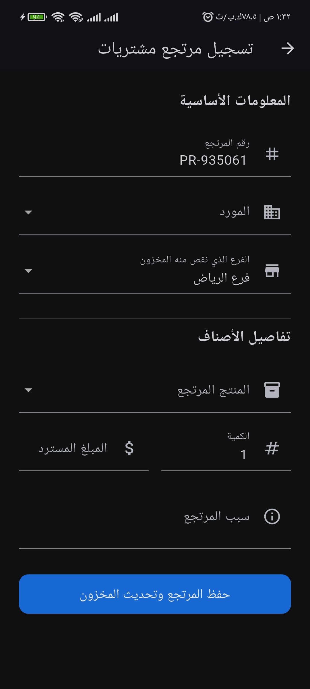
  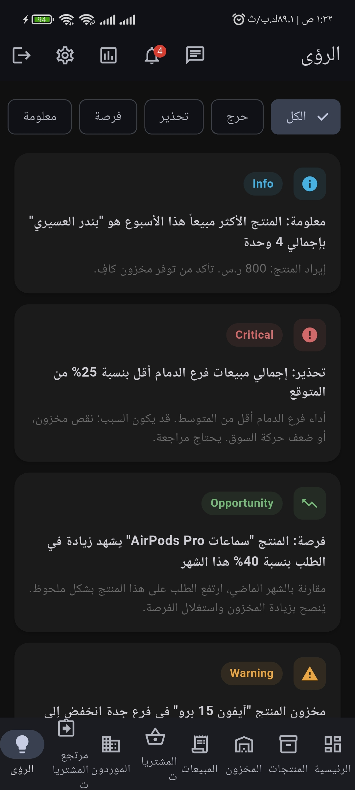
  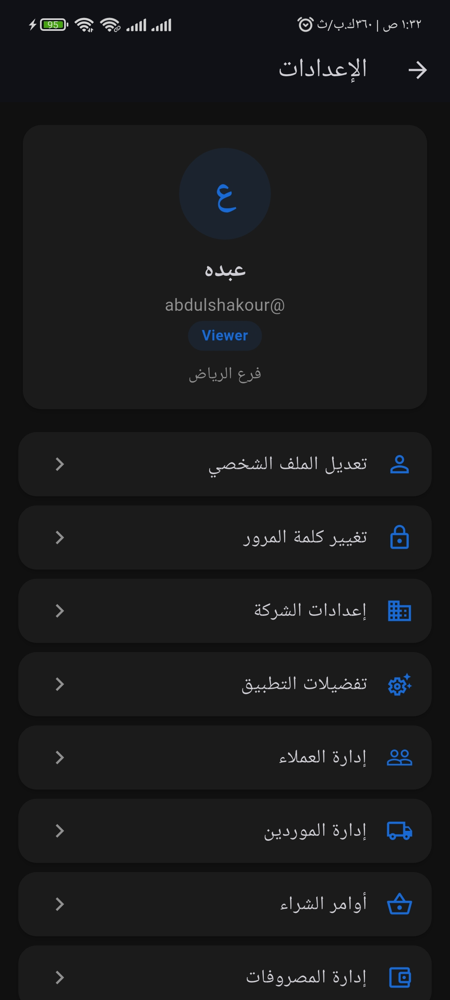
  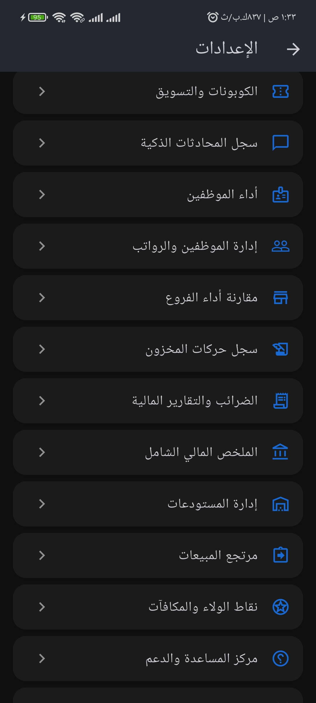
  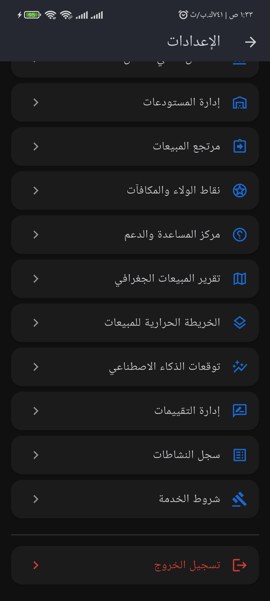
  
  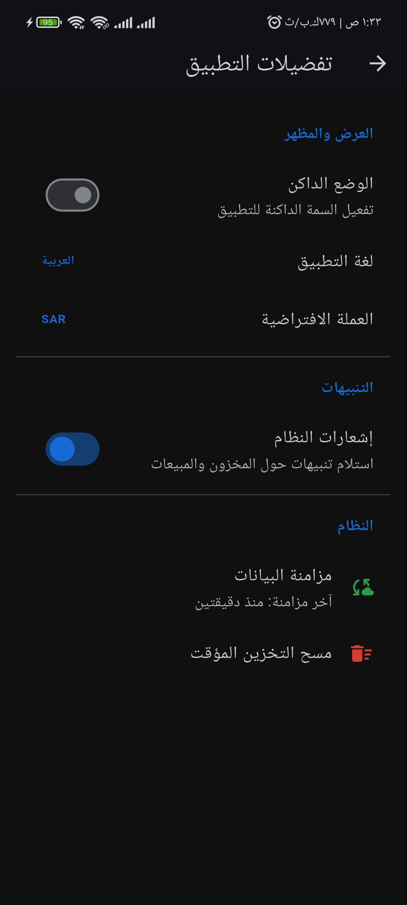
  
  
  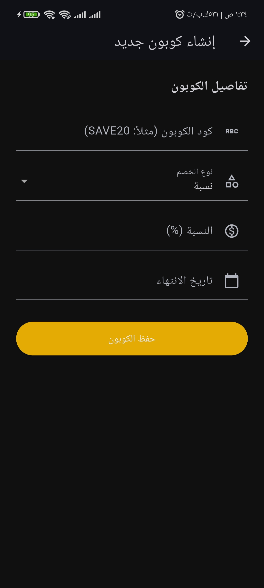
  
  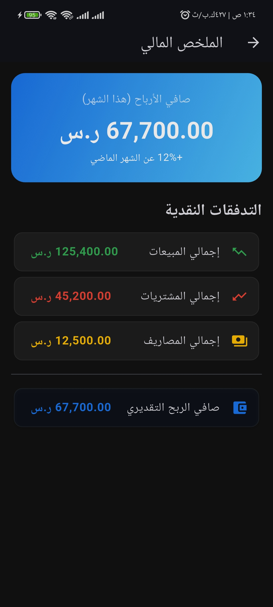
  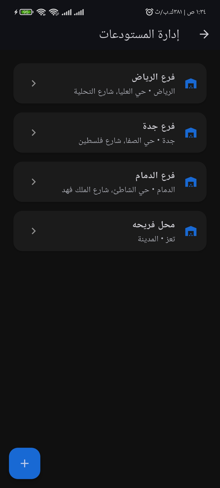
  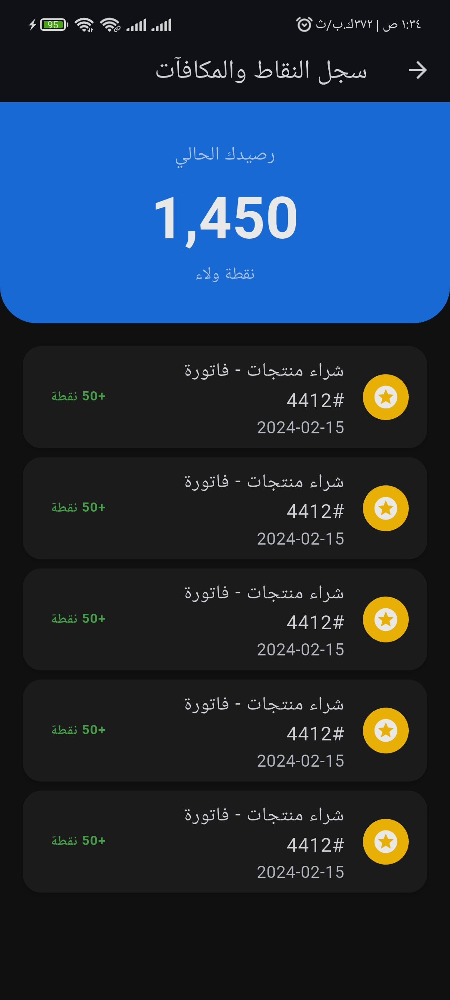
  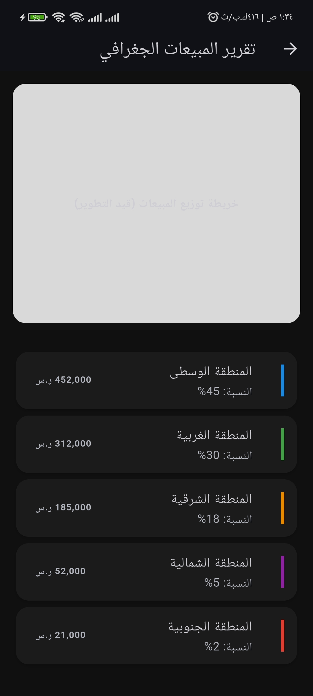
  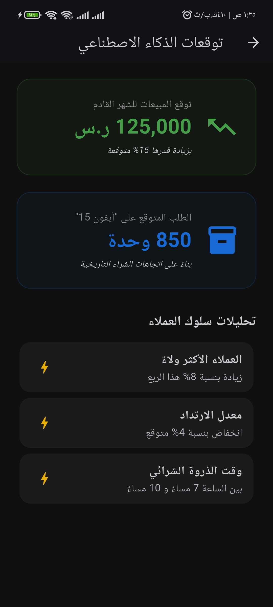
  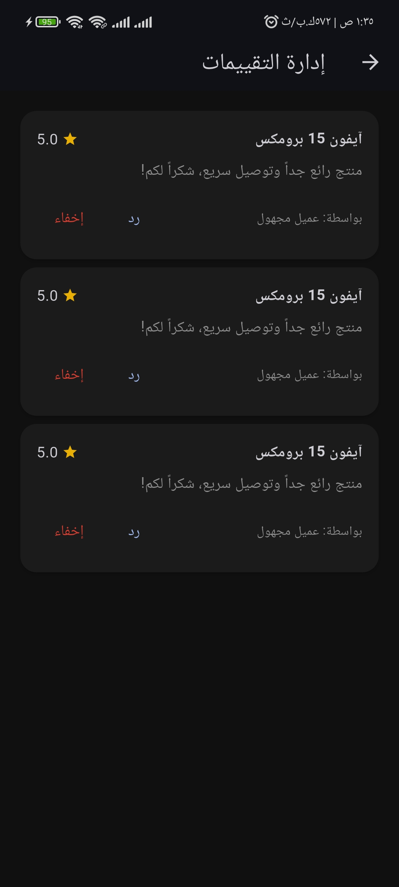
  
  
  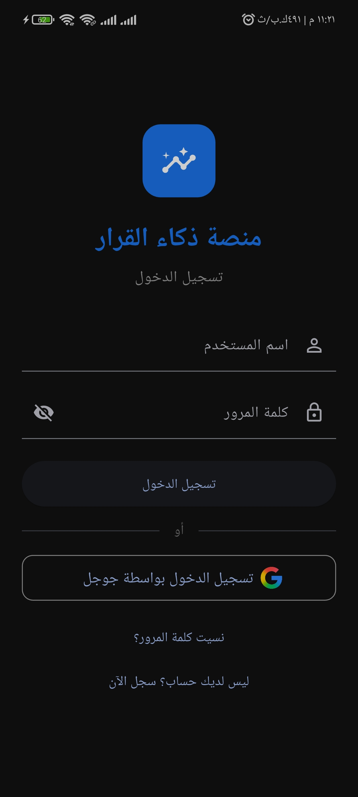
  

<!-- يمكنك إضافة المزيد من الصور بنفس السطر أعلاه عن طريق تغيير اسم الصورة -->
